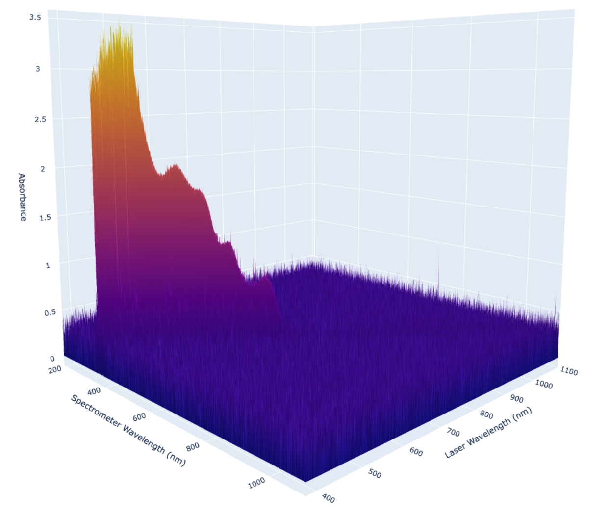

<h1 align="center">🌈 OpenSpectro</h1>
<h3 align="center">An Open-Source Spectroscopic Profiling Platform</h3>

<p align="center">
  
</p>

---

<p align="center">
  <a href="#features"><strong>Explore the Features 🚀</strong></a> ·
  <a href="#get-started">Quick Start ⚡</a> ·
  <a href="#algorithms">Algorithms 🌠 </a> ·
  <a href="https://doi.org/YOUR_DOI_HERE">Read the Paper 📄</a>
</p>

---

## 📊 Abstract

Spectroscopic analysis is essential for identifying optical molecular signatures across different wavelengths. **OpenSpectro** is an open-source platform that visualizes and shares molecular spectral data—specifically for human physiological biomarkers. It features:

- A preliminary database of 17 biomarkers  
- A spectral attention optimization model  
- Support for 3D graphing of molecular spectra  
- Tools for wavelength selection and sensor optimization

<h2 id="features">✨ Features</h2>

- 🎨 **Interactive 3D spectral plots**
- 🧬 **Custom biomarker attention mapping**
- 📚 **Extensible biomarker dataset**
- 🌐 **Open-source and collaborative**

<p align="center">
  
</p>

<h2 id="algorithms">🧮 Algorithms</h2>


| Goal | Learn per‑biomarker wavelength weights that **boost the target signal** and **suppress spectral overlap** |
|------|-----------------------------------------------------------------------------------------------------------|

**2‑D Spectroscopic Optimization**

| Item | Description |
|------|-------------|
| **Input** | `A` — absorbance matrix with shape **[N biomarkers × M wavelengths]** |
| **Learn** | Attention vector `w_i` ∈ \[0‑1\]^M for each biomarker _i_ |
| **Idea** | Maximize `alpha * (w_i · A_i)` minus `beta * Σ_{j≠i} (w_i · A_j)` |
| **Outcome** | A ranked list of wavelengths that isolate biomarker _i_ in crowded, noisy environments |

---

**3‑D Spectroscopic Optimization**

| Item | Description |
|------|-------------|
| **Input** | `S` — spectral tensor with shape **[N × M₁ LEDs × M₂ PDs]** (diagonal = absorbance, off‑diagonal = fluorescence) |
| **Learn** | Attention matrix `W_i` ∈ \[0‑1\]^{M₁ × M₂} for each biomarker _i_ |
| **Idea** | Maximize `alpha * ⟨W_i , S_i⟩` minus `beta * Σ_{j≠i} ⟨W_i , S_j⟩` |
| **Outcome** | Optimal LED/PD wavelength pairs that leverage both absorbance **and** fluorescence to boost specificity |

> **Quick take:**  
> • **alpha** rewards high‑signal regions, **beta** penalizes overlap.  
> • The same objective in 2‑D (spectra) generalizes to 3‑D (spectra + fluorescence).  
> • Outputs feed directly into sensor‑wavelength selection for **wearables** such as smart rings, patches, or bands.


<h2 id="get-started">🛠️ Get Started</h2>

```bash
git clone https://github.com/OpenSpectro/openspectro.github.io.git
cd openspectro
pip install -r requirements.txt
gunicorn main:app
```
## Attributes

- Image generated using Dall-E from the prompt "Spectroscopic Platform"
- Eid mubarak stickers created by Design Circle - Flaticon
